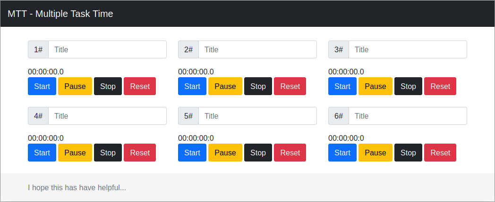

# MTT - Multiple Task Time

### Motivation
- Do you do many things almost at the same time?
- Don't know where you spend your time and ask the same question at the end of the day?
- Would you like to have a tool that could keep track of the time spent?
- And who knows, discovering that the various meetings that lead nowhere really do not lead to anything?
- if you have already asked any of these questions above, you are not alone, my motivation is to help you. 

## Install

### [NPM](https://www.npmjs.com/)
My case, on debian: `apt install npm`.

### [Parcel](https://parceljs.org/)
My case, on npm: `npm install -g parcel-bundler`.

## Dependency

### [EasyTimer.js](https://albert-gonzalez.github.io/easytimer.js/)
Easy to use Timer/Chronometer/Countdown library compatible with AMD and NodeJS.
 
### [Bootstrap](https://www.npmjs.com/package/bootstrap)
 Quickly design and customize responsive mobile-first sites with Bootstrap, the world’s most popular front-end open source toolkit, featuring Sass variables and mixins, responsive grid system, extensive prebuilt components, and powerful JavaScript plugins.

### [Jquery](https://www.npmjs.com/package/jquery)
jQuery is a fast, small, and feature-rich JavaScript library. It makes things like HTML document traversal and manipulation, event handling, animation, and Ajax much simpler with an easy-to-use API that works across a multitude of browsers. With a combination of versatility and extensibility, jQuery has changed the way that millions of people write JavaScript.

## Run app
Execute: `parcel index.html`

## Screen

